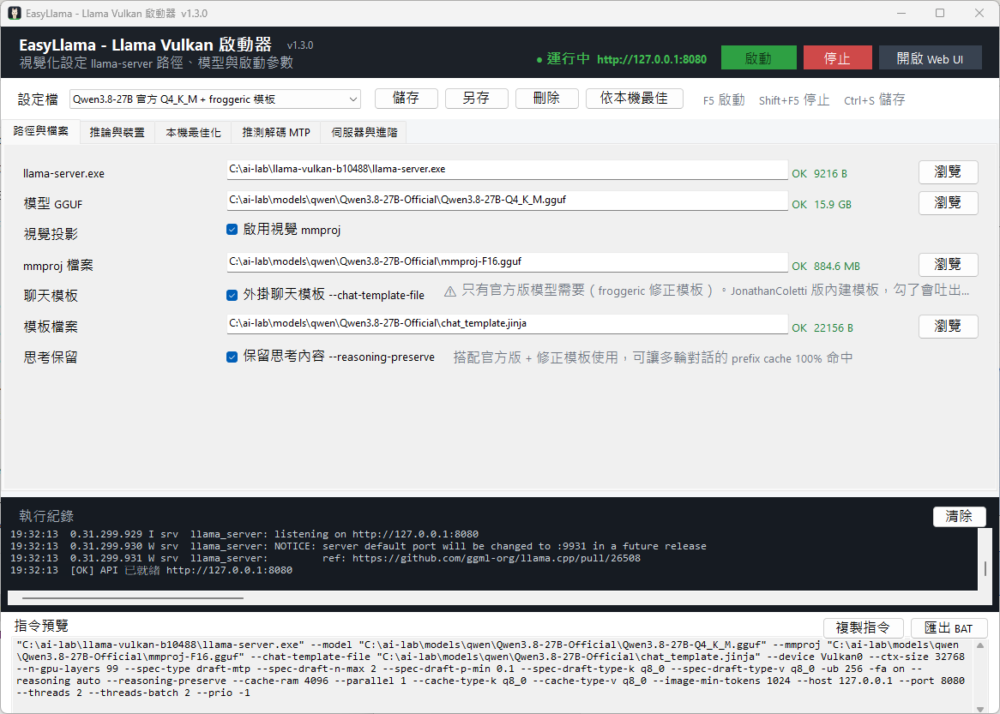

# EasyLlama — Llama Vulkan 啟動器

以視覺化介面設定並啟動 [llama.cpp](https://github.com/ggml-org/llama.cpp) 的 `llama-server`，
專為 Windows + Vulkan 後端使用情境設計。不必再手動拼湊冗長的命令列參數，
所有設定都能存成設定檔重複使用。

[](https://github.com/den13501/EasyLlama/actions/workflows/ci.yml)
[](https://github.com/den13501/EasyLlama/releases)
[](LICENSE)

- 版本：**v1.3.0**
- 平台：Windows（.NET Framework 4.8.1）
- 授權：MIT



## ⚠️ 關於這個專案的定位

**這是我依照自己的使用情境訂製的工具，不是通用型的最佳化方案。**

開發與實測環境是**「文書用電腦 + 後裝顯示卡」的 AI 應用環境**，
也就是在一台原本拿來跑 Office、開瀏覽器的機器上插一張顯卡跑本地模型，
**顯示卡記憶體充足，但系統主記憶體與 CPU 相對吃緊**的組合。

實測基準機：

| 項目 | 規格 |
| --- | --- |
| CPU | 6 核心（文書機等級） |
| 主記憶體 | 32 GB |
| 顯示卡 | RX 7900 XTX 24 GB（Vulkan） |
| 內顯 | Intel UHD 630（同時存在，需手動指定裝置） |
| 模型 | Qwen3.8-27B Q4_K_M（約 16 GB） |

因此本程式的**預設值、「本機最佳化」建議值、以及介面上的提示文字，
都是朝這個方向調校的**，例如預設保留 CPU 核心給辦公軟體、
在主記憶體吃緊時提出警告等。

如果你的環境不同（例如記憶體 128 GB 的工作站、純推論主機、
多卡環境、或 CPU 推論為主），**請不要照抄本程式的建議值**，
它很可能不適合你。介面上所有參數都可以自行調整，
建議搭配 llama.cpp 官方文件依自己的硬體實測後再決定。

> 簡單說：程式本身是通用的啟動介面，可以正常用；
> 但**內建的「建議值」帶有我個人環境的偏見**，請自行判斷。

## 特色

### 完整的參數視覺化
把 `llama-server` 常用參數整理成五個分頁：

| 分頁 | 內容 |
| --- | --- |
| 路徑與檔案 | `llama-server.exe`、模型 GGUF、mmproj 視覺模型、對話模板 |
| 推論與裝置 | Vulkan 裝置、context 長度、GPU 層數、KV cache 型別、Flash Attention、ubatch、mmap |
| 本機最佳化 | 依實際 CPU/RAM/VRAM 給出建議值，一鍵套用（建議邏輯偏向文書機環境，見上方定位說明） |
| 推測解碼 MTP | `--spec-type` 全系列（draft-mtp、ngram-cache 等）、draft 數量與門檻 |
| 伺服器與進階 | host/port、執行緒、行程優先權、額外自訂參數 |

### 隨執行檔更新自動調整
程式會解析 `llama-server --help` 的實際輸出，只送出這顆執行檔真正支援的旗標。
llama.cpp 改版（例如 `--no-mmap` 被 `--load-mode` 取代）時不會組出無效命令。

### Vulkan 偵測不到顯卡的自動修復
部分系統的 `HKLM\SOFTWARE\Khronos\Vulkan\Drivers` 註冊表遺失，
會導致明明有獨顯卻整個模型退回 CPU 執行。本程式會自動從顯示卡驅動註冊表找出 ICD 檔，
透過 `VK_ICD_FILENAMES` 傳給子行程，**不需修改系統設定，也不必重裝驅動**。

### 其他
- **設定檔管理**：多組設定命名保存、切換、另存、刪除
- **指令預覽**：即時顯示組好的命令列，可複製或匯出成 `.bat`
- **執行紀錄**：即時串接 `llama-server` 輸出，並偵測外部啟動的同名行程
- **綠色可攜**：設定存在執行檔旁的 `config\`，整個資料夾可直接搬移或放隨身碟
- **免重編譯客製**：介面文字與配色都可用外部 XML 覆寫
- **快捷鍵**：`F5` 啟動、`Shift+F5` 停止、`Ctrl+S` 儲存

## 系統需求

- Windows 10 / 11 64 位元
- [.NET Framework 4.8.1 執行階段](https://dotnet.microsoft.com/download/dotnet-framework/net481)
- 支援 Vulkan 的顯示卡與驅動
- llama.cpp 的 Vulkan 版 `llama-server.exe`（本專案**不含**，請自行下載）

## 快速開始

1. 於 [Releases](https://github.com/den13501/EasyLlama/releases) 下載 `LlamaVulkanLauncher-v1.3.0-win-x64.zip` 並解壓縮
2. 執行 `LlamaVulkanLauncher.exe`
3. 在「路徑與檔案」指定你的 `llama-server.exe` 與模型 GGUF
4. 切到「本機最佳化」按下建議按鈕套用適合本機的參數
5. 按「啟動」，狀態轉為運行中後即可點「開啟 Web UI」

## context 該設多大？（實測）

以下是在**基準機（24 GB 顯卡 / 32 GB 主記憶體 / 16 GB 模型）**上，
用實際對話負載（而非只看啟動瞬間）量測的結果。

> 📄 完整的排查過程、失敗的測試方法與方法論反省，
> 整理在 **[docs/benchmark-report.md](docs/benchmark-report.md)**。

| `--ctx-size` | 實測顯存 | 實測速度 | 結論 |
| ---: | ---: | ---: | --- |
| 16384 | 17.41 GB | 56~59 t/s | 可用 |
| **32768** | **17.92 GB** | **53~63 t/s** | ✅ **建議值** |
| 65536 | 18.91 GB | **8.6~9 t/s** | ❌ 越過臨界點 |

共通參數：`-ngl 99`、`-fa on`、`--cache-type-k/v q8_0`、`-ub 256`、
`--cache-ram 4096`、`--parallel 1`、`--spec-type draft-mtp`。

### ⚠️ 顯存臨界點：多 1 GB 就掉七倍速

上表最重要的一列是 65536：顯存只比 32768 多用 **1 GB**，
速度卻從 60 t/s 掉到 **9 t/s**。這不是漸進衰減，是**斷崖式崩潰**。

原因是顯示卡不會讓單一程式用滿標示容量（24 GB 的卡實測約 **18.5 GB** 就觸頂），
越線之後部分資料被放到系統記憶體，每次推論都得走 PCIe，
於是 GPU 使用率看起來 99%，其實一直在等資料。

**而且這與「實際用到多深」無關**：KV cache 在啟動時就依 `--ctx-size`
上限全量配置，所以 ctx 65536 即使只用 2000 token，一樣只有 9 t/s。

> 換句話說：**「載得進去」不等於「跑得快」**。
> 開大 context 前請先確認顯存還有餘裕，寧可少開一階。

### 32K 上下文適合做什麼

顯存決定了上下文上限，也就決定了這台機器適合的用途：

| 適合 | 不適合 |
| --- | --- |
| Agent / 工具呼叫（每輪都短） | 整包 codebase 分析 |
| 日常問答、翻譯 | 長篇 PDF、論文 |
| 寫程式（單一檔案） | 大型 log 排查 |
| 分析單一設定檔（約 50 KB 以內） | 一次餵入多個大檔 |

想突破限制只有兩條路：**換更小的模型**（例如 14B Q4，省下的顯存可換更大
上下文），或**把輸入分段餵入**。加主記憶體沒有幫助，瓶頸在顯示卡。

### 上下文深度對速度的影響（ctx 32768）

在安全範圍內，速度只會隨對話變長而緩降，不會崩潰：

| 對話深度 | 速度 | 顯存 |
| ---: | ---: | ---: |
| 2,000 | 62.72 t/s | 17.92 GB |
| 8,000 | 59.41 t/s | 17.92 GB |
| 16,000 | 57.71 t/s | 17.92 GB |
| 24,000 | 52.89 t/s | 17.92 GB |
| 30,000 | 53.62 t/s | 17.92 GB |

### 需要多大的 context？

context 要看**輸入實際換算成幾個 token**，而不是檔案幾 KB。
以本機模型實測，純文字設定檔約 **1 KB ≈ 570 tokens**（符號多的檔案更耗 token）：

| 輸入檔案大小 | 約需 token | 在 24 GB 卡上可行嗎 |
| ---: | ---: | --- |
| 30 KB | 約 1.7 萬 | ✅ ctx 32768 可容納 |
| 50 KB | 約 2.9 萬 | ✅ 接近 32768 上限 |
| 90 KB | 約 5.3 萬 | ❌ 需分段，硬開 65536 會掉速 |
| 160 KB | 約 11 萬 | ❌ 需分段 |
| 2 MB | 約 118 萬 | ❌ 遠超模型上限 |

也就是說，24 GB 顯卡跑 27B Q4 模型時，**單次能處理的檔案上限約 50 KB**。
更大的檔案請先切段（或先篩出關心的區段）再餵，
硬把 `--ctx-size` 開大只會換來十分之一的速度。

> 想確認自己的檔案要多少 token，可用 llama.cpp 附的
> `llama-tokenize.exe -m 模型.gguf -f 檔案 --show-count`。

### 幾個實測得到的經驗

- **context 不是愈大愈好**。KV cache 會依 `--ctx-size` 上限在啟動時全量配置，
  一旦越過顯存臨界點，速度直接掉到十分之一，而且跟你實際用多少無關。
- **判斷方式**：啟動後看顯存佔用，若接近顯示卡容量的八成就該降一階。
  以 24 GB 的卡為例，超過約 18.5 GB 就會開始掉速。
- **主記憶體被灌滿通常不是 context 造成的**，比較常見的元凶是
  勾了「不使用 mmap」（等於整份模型再吃一份記憶體）與 `--cache-ram` 設太大。
- `--cache-ram` 是**上限值**，用多少佔多少，剛啟動時看不出差別，長對話才會長上去。

⚠️ 以上數字只在**這台基準機**成立，換顯卡、換模型、換量化等級都會不同，
請當作「怎麼推算」的範例，而不是可以直接照抄的答案。

## 自行編譯

需要 [.NET SDK 8.0 或更新版本](https://dotnet.microsoft.com/download/dotnet)（開發時使用 SDK 10.0.400）：

```powershell
git clone https://github.com/den13501/EasyLlama.git
cd EasyLlama
dotnet build -c Release
```

產物位於 `bin\Release\LlamaVulkanLauncher.exe`。

> 專案已引用 `Microsoft.NETFramework.ReferenceAssemblies.net481`，
> 因此**不需要另外安裝 .NET Framework 4.8.1 Developer Pack**，
> 只要有 .NET SDK 與可連線 nuget.org 的環境即可建置。

### 自動發布

本專案使用 GitHub Actions 自動建置與發布：

- **CI**：推送到 `main` 或開啟 Pull Request 時自動驗證建置
- **Release**：推送 `v*` 格式的 tag 時，自動編譯並發布 Release，附上 zip 與 SHA256 校驗檔

```powershell
git tag -a v1.3.0 -m "v1.3.0"
git push origin v1.3.0
```

## 客製化

設定都放在執行檔旁的 `config\` 資料夾，改完重開程式即生效。

### 換介面語言
內建繁體中文。要翻成其他語言：

1. 複製 `config\lang\zh-TW.sample.xml` 成 `config\lang\en-US.xml`
2. 只修改每列的 `value`，`key` 保持不變
3. 在 `config\language.txt` 寫入 `en-US`

未指定語言時會嘗試比對系統語言。語言檔只覆蓋有寫到的項目，翻譯不完整也能正常使用。

### 換配色
複製 `config\theme.sample.xml` 成 `config\theme.xml` 後修改色值（`#RRGGBB` 或 `#AARRGGBB`）。

## 檔案說明

| 檔案 | 職責 |
| --- | --- |
| `MainForm.cs` | 主視窗與所有介面邏輯 |
| `CommandBuilder.cs` | 依設定組出 `llama-server` 命令列 |
| `ServerProcess.cs` | 子行程生命週期與輸出串接 |
| `ServerCapabilities.cs` | 解析 `--help` 判斷可用旗標 |
| `HardwareTuner.cs` | 依本機硬體推算建議參數 |
| `SystemResources.cs` | CPU / RAM / VRAM 偵測 |
| `VulkanFix.cs` | Vulkan ICD 自動修復 |
| `LaunchProfile.cs` / `ProfileStore.cs` | 設定檔資料結構與存取 |
| `Strings.cs` / `DefaultTexts.cs` | 多語系文字 |
| `Theme.cs` | 配色管理 |
| `tools\bench-loadmode.ps1` | 比較 `--load-mode` 對速度與記憶體的影響 |
| `tools\bench-ctx-vram.ps1` | 量測不同 `--ctx-size` / `--cache-ram` 的啟動佔用 |
| `tools\bench-ctx-load.ps1` | **模擬長對話負載**，量出速度與顯存曲線（判斷臨界點用） |

| `docs\benchmark-report.md` | 掉速問題的完整排查實錄與方法論 |
| `CHANGELOG.md` | 各版本更新紀錄 |

`tools\` 下的三支 PowerShell 腳本是我用來產生上面那些實測數字的，
內容寫死了我自己的模型與執行檔路徑，**要用請先改開頭的變數**。
你可以拿它們在自己的機器上跑一次，得到屬於你環境的數據。

## 注意事項

- 本專案僅為 `llama-server` 的啟動介面，不包含推論引擎與任何模型檔
- `config\settings.xml` 含個人本機路徑，分享設定前請自行檢查
- 與 llama.cpp 官方專案無隸屬關係
- 內建建議值與 README 中的實測數據，皆來自單一台基準機，
  **不保證適用於其他硬體組合**，請自行驗證後再使用

## 問題回報與貢獻

歡迎於 [Issues](https://github.com/den13501/EasyLlama/issues) 回報問題或提出建議，
也歡迎送出 Pull Request（特別是其他語言的翻譯檔）。

## 授權

MIT License，詳見 [LICENSE](LICENSE)。
